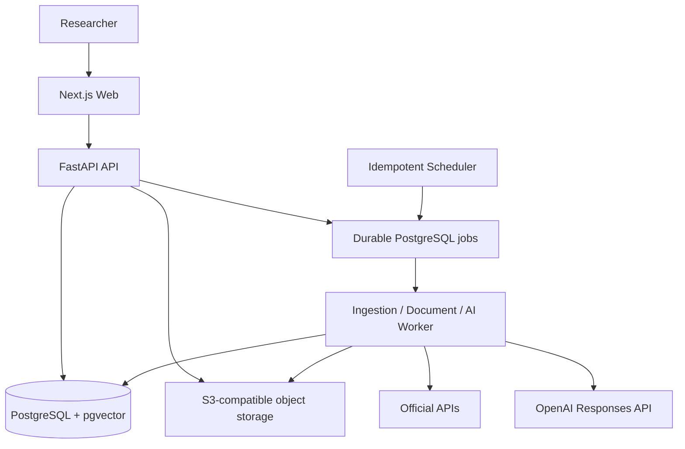

# MacroLens Production Architecture

## 1. Architecture decision

MacroLens uses a **modular monolith with independent background workers**. The initial production topology has three deployable units:

1. `web`: Next.js application;
2. `api`: FastAPI application;
3. `worker` and `scheduler`: Python processes sharing the backend package and database contracts.

The system intentionally avoids Redis, Kafka, OpenSearch, ClickHouse and Kubernetes in v1. PostgreSQL is the source of truth, the durable job queue, the full-text search engine and the vector store. Those components may be introduced later only when measured load demonstrates a need.

## 2. Domain boundaries

The backend is divided by domain rather than transport:

- `source`: providers, datasets, source-series mappings and licenses;
- `catalog`: canonical indicators, aliases and taxonomy trees;
- `ingestion`: raw objects, runs, quality results and publication batches;
- `data`: immutable vintages, latest observations, derived definitions and dependencies;
- `release`: release events, forecasts and market-reaction snapshots;
- `docs`: documents, versions, chunks and attachments;
- `fomc`: meetings, votes, projections, dot plots and licensed probabilities;
- `app`: users, sessions, projects, notes, favorites, alerts, notifications and AI runs;
- `audit`: immutable change records.

Each domain may later be extracted without changing its public API contract.

## 3. Data lifecycle

```mermaid
flowchart LR
    Q[Scheduled or manual job] --> F[Fetch source]
    F --> R[Persist raw response + hash]
    R --> N[Normalize]
    N --> V[Validate metadata and values]
    V --> D[Detect insert or revision]
    D --> G[Quality gate]
    G --> B[Atomic publication batch]
    B --> C[Recalculate dependent series]
    C --> E[Outbox / notifications]
```

Rules:

- source responses are written to object storage before parsing;
- `data.observation_vintage` is append-only;
- the latest table is a serving projection, not the historical source of truth;
- every observation has source series, ingestion run and optional raw-object lineage;
- publication is blocked by blocking quality failures;
- restricted data is filtered by `source.license_policy` before display, download, API redistribution or AI use.

## 4. Request and authentication model

- Browser authentication uses short-lived access and rotating refresh cookies;
- cookies are HTTP-only; production uses Secure and `SameSite=None` because Web and API may have different origins;
- state-changing cookie-auth requests are origin checked;
- refresh sessions are stored server-side and can be revoked;
- workspace ownership is verified for all user-scoped resources;
- admin endpoints require the `admin` role;
- local rate limiting is defense-in-depth; production authoritative limiting belongs at Cloud Armor, Cloudflare or another edge gateway.

## 5. AI architecture

The model does not receive database credentials. It works through controlled context assembly:

1. validate workspace and licenses;
2. snapshot selected indicators, periods and vintages;
3. retrieve document chunks with PostgreSQL full-text/vector search;
4. call the OpenAI Responses API;
5. validate numbered citations against the supplied evidence;
6. persist answer, model, prompt version, data cutoff, token use and citations.

A response without validated evidence must be marked failed or incomplete rather than silently published.

## 6. Scaling path

| Measured problem | Upgrade |
|---|---|
| Repeated hot reads saturate PostgreSQL | Add Redis only for read-through caching |
| Provider dependencies and backfills become difficult | Add Dagster for data assets and partitions |
| Long multi-day business workflows need durable compensation | Add Temporal |
| Document search outgrows PostgreSQL | Add OpenSearch |
| Analytical observations exceed practical PostgreSQL scale | Add ClickHouse while PostgreSQL remains catalog/system of record |
| One event requires many independent consumers | Add an event bus |
| Multiple services require independent autoscaling and network policy | Move to Kubernetes or managed equivalents |
